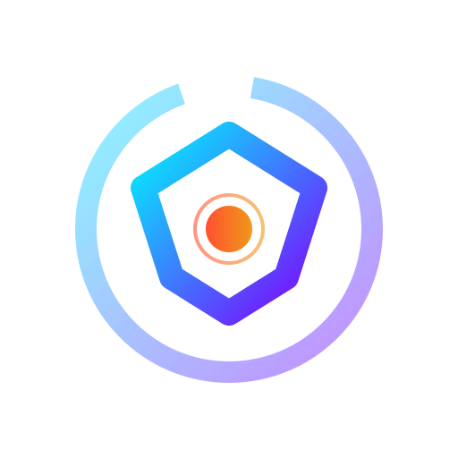

# Vulpis VR

An experimental spatial browser for viewing compatible 360° and VR180 videos with PSVR2 on PC through SteamVR.

This is a real fork of [Mozilla's Firefox source repository](https://github.com/mozilla-firefox/firefox), based on `FIREFOX_153_2_0esr_RELEASE`. It also includes adaptations informed by [Firefox Reality PC](https://github.com/MozillaReality/gecko-dev). The work started as a personal project to make VR web video usable on PSVR2 and is shared for others facing the same problem.

**Source preview — there is no validated installer or portable public binary release yet.** The development build has been tested on the maintainer's PSVR2 setup; other PCs, media formats and sites need further testing. This is not a replacement for a maintained general-purpose browser for sensitive browsing.

## Why PSVR2 is the target

**The primary target is PSVR2 on a Windows PC, with PSVR2 Sense controllers and SteamVR.** Sony's supported PC setup uses Steam, SteamVR and the PlayStation VR2 App ([official requirements](https://www.playstation.com/en-us/support/hardware/pc-prepare-ps-vr2/)). A headset working in SteamVR does not, by itself, give a web video player an immersive playback path into that headset.

In the maintainer's tested environment, ordinary browser playback did not provide the needed end-to-end experience for YouTube and other compatible 360/VR180 web content: spatial browsing, the correct panorama in the headset, controller input and a reliable return to the page. This describes the motivation and observed integration gap, not an assertion that PSVR2 hardware can never work with any other browser or application.

Vulpis bridges that gap by adapting the Gecko/FxR browser: a native OpenVR panel presents the browser in SteamVR; the media bridge accesses the page's video element and renders supported projections in WebXR; repaired browser-to-VR texture/session paths deliver frames through OpenVR to SteamVR and PSVR2. Sense controls provide navigation, recentering and exit. ERP/EAC interpretation and supported VR180 metadata/mesh handling avoid treating every stream as the same stretched browser image.

This is currently a modified browser, not a universal extension, driver replacement or modification of the headset firmware. It still relies on SteamVR. Compatibility with other headsets is not claimed without testing. See [architecture and scope](vulpis/ARCHITECTURE.md).

## What works in the tested setup

- A browser panel in the SteamVR dashboard or detached into the environment, with drag controls.
- Compatible 360° and VR180 playback using the page's media element and a dedicated renderer, rather than projecting the entire browser screenshot as a panorama.
- PSVR2 Sense navigation, trigger recentering and R1/grip return to the browser.
- Return from immersive playback to the detached panel or dashboard, depending on where playback began.
- Offscreen rendering and a desktop-visibility option in the tested development configuration.
- A one-time, translated onboarding bubble near the goggles button. Its original generic trigger diagram animates without audio; reduced-motion settings show a static frame.

Rendering interpretation depends on the delivered media projection. The project does not promise that every YouTube video, stereo layout, fisheye or mesh format works. Site changes can break integrations independently of browser updates.

## Known limitation: moving in SteamVR Home

In the tested PSVR2 setup, analog-stick locomotion in SteamVR Home is unavailable while the browser is an interactive **detached window**. Simultaneous room navigation and browser interaction is not supported by the current input mode. This does not refer to physical headset tracking. Selective input sharing is deferred to V2; see [findings and validation plan](vulpis/INPUT_COEXISTENCE_V2.md).

## Requirements and use

Windows x64, a GPU/driver capable of decoding the chosen video, a correctly configured PSVR2 PC setup, paired Sense controllers, SteamVR and the PlayStation VR2 App. Those external applications are installed separately; they are not bundled here. Verify that the headset and controllers already work in SteamVR.

For developers, see [build notes](vulpis/BUILD.md). A future release will provide installation instructions, checksums and a clean profile. Do not copy the maintainer's personal profile or assume development scripts are portable.

The initial page defaults to Google and can be changed through `vulpis.startup.homepage`. The old localhost test harness is not required for startup. Open a compatible video, use the goggles button, then choose 360° or VR180. During playback, look in the desired direction and press the trigger to recenter; R1/grip returns to the browser.

The new tutorial uses Gecko's native Fluent/DOMLocalization APIs and follows the application locale, with English and Brazilian Portuguese resources. This does not install a full browser language pack; remaining older custom controls still require localization work.

## Source, builds and updates

The `vulpis-vr` branch contains the imported modifications on the official base tag. Upstream source and component notices remain intact. See [import record](vulpis/SOURCE_IMPORT.md) for the exact baseline and verification scope.

The existing build disables the updater. A future update channel must ship only Vulpis builds after testing against updated Gecko versions; do not point it at stock Firefox binaries. Full installer/executable rebranding, security defaults, language packs, long-session testing and clean-PC installation remain release tasks. No automatic compatibility with arbitrary browser or SteamVR updates is claimed.

## Independence and licensing

Vulpis VR is an independent community project based on Firefox/Gecko, with work adapted from Firefox Reality. It is not developed, sponsored, endorsed by or affiliated with Mozilla, Valve, Sony or Google/YouTube. Product names identify source lineage or interoperability, not official support.

Modified MPL-covered code remains under **MPL 2.0**. Other components retain their own licenses. The upstream [LICENSE](LICENSE), [complete Gecko notices](toolkit/content/license.html), component license files and packaged `about:license` page are preserved. The current FxR panel could not navigate to that internal page in testing, so its license button links to this public section. [OpenVR's BSD-style three-clause license](gfx/vr/service/openvr/LICENSE) is also retained.

The supplied Vulpis logo is dedicated under **CC0 1.0**, to the extent of the maintainer's rights, with no attribution required. See [artwork terms](vulpis/assets/LICENSE.md). The public tutorial uses a new generic vector diagram; drawings derived from a third-party controller photograph are excluded.

The source license does not grant Mozilla or other third-party trademark rights. Original credits, notices and technical identifiers are retained. The existing development executable still needs a separate release/branding audit. See [licensing review](LICENSING_REVIEW.md).

## Issues and screenshots

Report the build, Windows version, GPU/driver, SteamVR version, selected mode, resolution/codec if known, steps and expected/actual result. Remove private URLs, account details and tokens before sharing logs. Do not upload an entire browser profile.

Screenshots will be added by the maintainer. No downloaded videos or platform installers are distributed here.

## Complete upstream license index

### Full upstream collection index

This index comes from the baseline `toolkit/content/license.html`, including conditional components. It does not imply that every component ships in a Windows binary. Per-file notices govern; additional tools and tests retain licenses in their source directories.

Show all Gecko license index entries

- [Mozilla Public License 2.0](toolkit/content/license.html#mpl)
- [GNU Lesser General Public License 2.1](toolkit/content/license.html#lgpl)
- [GNU Lesser General Public License 3.0](toolkit/content/license.html#lgpl-3.0)
- [acorn License](toolkit/content/license.html#acorn)
- [Adjust SDK License](toolkit/content/license.html#adjust)
- [Android Open Source License](toolkit/content/license.html#android)
- [ANGLE License](toolkit/content/license.html#angle)
- [Apache License 2.0](toolkit/content/license.html#apache)
- [Apache License 2.0 with LLVM exception](toolkit/content/license.html#apache-llvm)
- [Apple License](toolkit/content/license.html#apple)
- [Apple Password Rules Parser License](toolkit/content/license.html#apple-password-rules-parser)
- [ARM License](toolkit/content/license.html#arm)
- [Babel License](toolkit/content/license.html#babel)
- [Babylon License](toolkit/content/license.html#babylon)
- [boost License](toolkit/content/license.html#boost)
- [BSD 2-Clause License](toolkit/content/license.html#bsd2clause)
- [BSD 3-Clause License](toolkit/content/license.html#bsd3clause)
- [bspatch License](toolkit/content/license.html#bspatch)
- [Cairo Component Licenses](toolkit/content/license.html#cairo)
- [Chromium License](toolkit/content/license.html#chromium)
- [CodeMirror License](toolkit/content/license.html#codemirror)
- [CodeMirror 6 License](toolkit/content/license.html#codemirror6)
- [CRYPTOGAMS License](toolkit/content/license.html#cryptogams)
- [cubic-bezier License](toolkit/content/license.html#cubic-bezier)
- [D3 License](toolkit/content/license.html#d3)
- [Dagre-D3 License](toolkit/content/license.html#dagre-d3)
- [diff License](toolkit/content/license.html#diff)
- [Disconnect.Me License](toolkit/content/license.html#disconnect.me)
- [dtoa License](toolkit/content/license.html#dtoa)
- [Dutch Spellchecking Dictionary License](toolkit/content/license.html#hunspell-nl)
- [English Spellchecking Dictionary Licenses](toolkit/content/license.html#hunspell-en)
- [Estonian Spellchecking Dictionary License](toolkit/content/license.html#hunspell-ee)
- [Expat License](toolkit/content/license.html#expat)
- [Firebug License](toolkit/content/license.html#firebug)
- [gfxFontList License](toolkit/content/license.html#gfx-font-list)
- [Google BSD License](toolkit/content/license.html#google-bsd)
- [Google Gears/iStumbler License](toolkit/content/license.html#gears-istumbler)
- [Google VP8 License](toolkit/content/license.html#vp8)
- [gyp License](toolkit/content/license.html#gyp)
- [halloc License](toolkit/content/license.html#halloc)
- [HarfBuzz License](toolkit/content/license.html#harfbuzz)
- [ICU License](toolkit/content/license.html#icu)
- [Immutable.js License](toolkit/content/license.html#immutable)
- [Japan Network Information Center License](toolkit/content/license.html#jpnic)
- [jemalloc License](toolkit/content/license.html#jemalloc)
- [jQuery License](toolkit/content/license.html#jquery)
- [k_exp License](toolkit/content/license.html#k_exp)
- [libc++ License](toolkit/content/license.html#libc++)
- [libcubeb License](toolkit/content/license.html#libcubeb)
- [libevent License](toolkit/content/license.html#libevent)
- [libffi License](toolkit/content/license.html#libffi)
- [libjingle License](toolkit/content/license.html#libjingle)
- [libnestegg License](toolkit/content/license.html#libnestegg)
- [libsoundtouch License](toolkit/content/license.html#libsoundtouch)
- [libyuv License](toolkit/content/license.html#libyuv)
- [Lithuanian Spellchecking Dictionary License](toolkit/content/license.html#hunspell-lt)
- [lodash License](toolkit/content/license.html#lodash)
- [MIT License](toolkit/content/license.html#mit)
- [MySpell License](toolkit/content/license.html#myspell)
- [nICEr License](toolkit/content/license.html#nicer)
- [node-md5 License](toolkit/content/license.html#node-md5)
- [nom License](toolkit/content/license.html#nom)
- [nrappkit License](toolkit/content/license.html#nrappkit)
- [OpenVision License](toolkit/content/license.html#openvision)
- [OpenVR License](toolkit/content/license.html#openvr)
- [praton License](toolkit/content/license.html#praton)
- [praton and inet_ntop License](toolkit/content/license.html#praton1)
- [ProseMirror License](toolkit/content/license.html#prosemirror)
- [qcms License](toolkit/content/license.html#qcms)
- [QR Code Generator License](toolkit/content/license.html#qrcode-generator)
- [React License](toolkit/content/license.html#react)
- [React-Redux License](toolkit/content/license.html#react-redux)
- [Red Hat xdg_user_dir_lookup License](toolkit/content/license.html#xdg)
- [Redux License](toolkit/content/license.html#redux)
- [Russian Spellchecking Dictionary License](toolkit/content/license.html#hunspell-ru)
- [SCTP Licenses](toolkit/content/license.html#sctp)
- [Skia License](toolkit/content/license.html#skia)
- [Snappy License](toolkit/content/license.html#snappy)
- [sprintf.js License](toolkit/content/license.html#sprintf.js)
- [SunSoft License](toolkit/content/license.html#sunsoft)
- [SuperFastHash License](toolkit/content/license.html#superfasthash)
- [Twemoji License](toolkit/content/license.html#twemoji)
- [unicase License](toolkit/content/license.html#unicase)
- [Unicode License](toolkit/content/license.html#unicode)
- [Unicode License V3](toolkit/content/license.html#unicode-v3)
- [University of California License](toolkit/content/license.html#ucal)
- [V8 License](toolkit/content/license.html#v8)
- [Validator License](toolkit/content/license.html#validator)
- [VTune License](toolkit/content/license.html#vtune)
- [WebRTC License](toolkit/content/license.html#webrtc)
- [x264 License](toolkit/content/license.html#x264)
- [Xiph.org Foundation License](toolkit/content/license.html#xiph)
- [LLVM release license](toolkit/content/license.html#llvm)
- [DirectXShaderCompiler dependencies](toolkit/content/license.html#dxcompiler-deps)
- [Other Required Notices](toolkit/content/license.html#other-notices)
- [Optional Notices](toolkit/content/license.html#optional-notices)
- [Proprietary Operating System Components](toolkit/content/license.html#proprietary-notices)

<!-- LICENSE-INDEX-END -->
